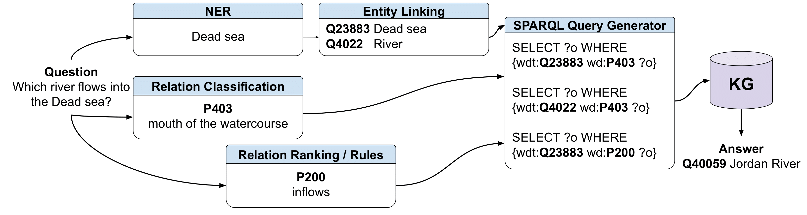

# Konstructor: A Strong Baseline for Simple KG Question Answering

**Abstract.** While being one of the most popular question types, sim-
ple questions such as “Who is the author of Cinderella?”, are still not
completely solved. Namely, in this paper, we show that even the modern
end-to-end neural approaches, such as Large Language Models, are prone
to errors. At the same time, as an answer is usually one hop away from a
question, one can try to develop a method that use structured Semantic
Web data to answer simple questions. We propose an efficient robust
component-based approach Konstructor by breaking down the problem
into three main steps: (i) entity extraction and entity linking, (ii) relation
prediction, and (iii) querying the knowledge graph. Our approach inte-
grates language models and knowledge graphs, exploiting the power of
the former and the interpretability of the latter. We experiment with two
named entity recognition and entity linking methods and several relation
detection techniques: using classification, ranking, generation, or similar-
ity search. We show that for relation detection, the most challenging step
of the workflow, a combination of relation classification/generation and
ranking outperforms other methods, thus maximising accuracy and guar-
anteeing the prediction of non-empty answers. As a result, we reported
strong results for different datasets.

## Method overview

The method consists of three main steps:

1) Entity Extraction and Entity Linking
2) Reladtion detection
3) SPARQL query that parses the KG (Wikidata)

For entity extraction is trained customly trained Spacy NER.
For entity linking are used [mGENRE](https://github.com/facebookresearch/GENRE) and [BELA](https://github.com/facebookresearch/BELA).
Four methods of relation detection are offered: relation classification, relation ranking, relation generation and rule-based detection.

The adapted version of the relation classification is taken from the [Huang, Y., Giledereli, B., Köksal, A., Özgür, A., & Ozkirimli, E. (2021). Balancing methods for multi-label text classification with long-tailed class distribution. arXiv preprint arXiv:2109.04712.](https://github.com/Roche/BalancedLossNLP).

and the adapted version of relation ranking is taken from [Hu, N., Wu, Y., Qi, G., Min, D., Chen, J., Pan, J. Z., & Ali, Z. (2023). An empirical study of pre-trained language models in simple knowledge graph question answering. World Wide Web, 1-32.](https://github.com/HuuuNan/PLMs-in-Practical-KBQA).

## Requirements

To run the repository use Dockefile and the corresponding requirements.txt file.

## Datasets

In the **Datasets** section you can find subsets of datasets used in the paper.

Moreover, in the **Filtration** section is presented code for the filtering process of each dataset.

Originally, datasets are taken from [SimpleQuestionsWikidata](https://github.com/askplatypus/wikidata-simplequestions), [RuBQ 2.0](https://github.com/vladislavneon/RuBQ), [LC-QuAD2.0](https://github.com/AskNowQA/LC-QuAD2.0) and [Mintaka](https://github.com/amazon-science/mintaka).

